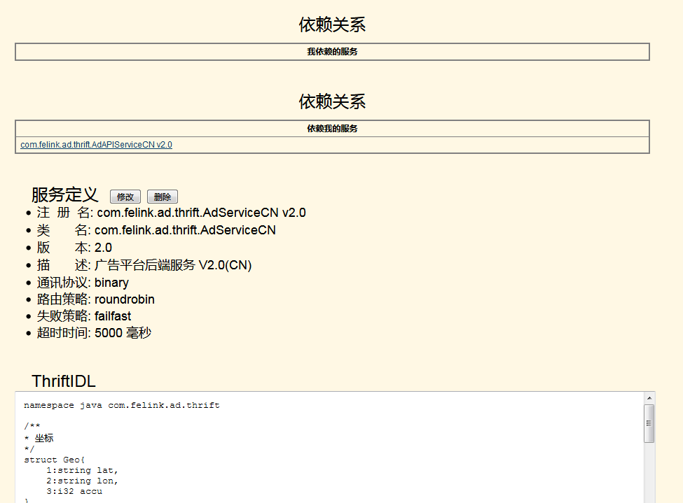
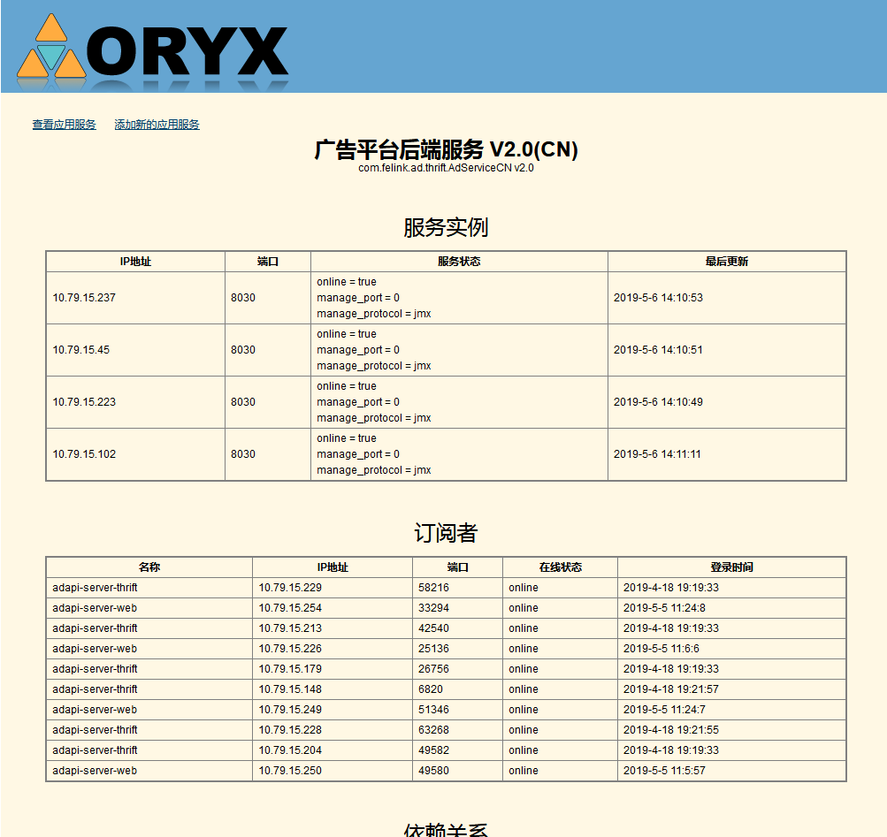
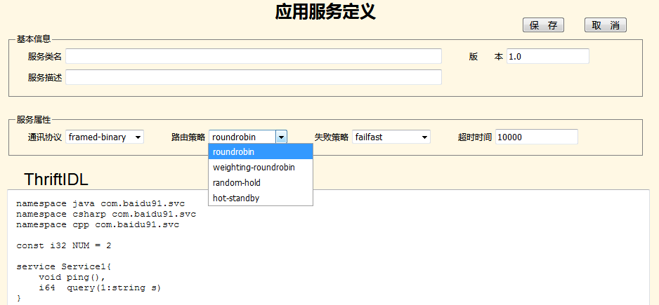

# dsf （Distributed Service Framework）

1、简介
    2013年为91手机助手开发的基于thrift的分布式RPC框架，当时Dubbo还未开源，新浪还未开始分布式RPC框架的开发，我参考了《淘宝这十年》中对DSF几句特性描述，开发了这套框架。注册服务由erlang编写，客户端框架有Java与C#两个版本。91手助已经是昨日黄花，这两天整理硬盘看到了这些老代码，保存到这做个纪念吧。
    感慨下，erlang确实是强大的，注册服务器已经连续运行超过2年没有任何故障也没有重启了，而且两年前的那次重启还是因为换硬盘，而换硬盘前也已经连续运行了1年半。现在虽然没有再研究erlang了，但现在最喜爱的Akka框架也是参考的erlang，向erlang致敬！

2、几张系统截图

